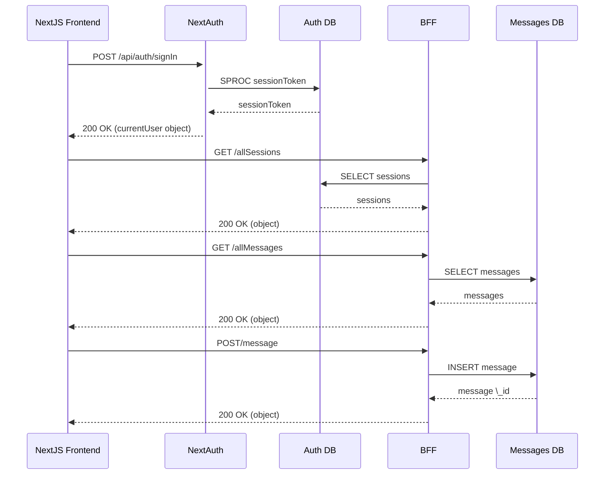

 

## Goals

Here's how our NextJS frontend, NextAuth, and our Backend-for-Frontend (BFF) server coordinate to do auth, show online users, and GET and POST messages.

## High level design

 

<!--MERMAID {width:100}-->

<!--MCONTENT {content: "sequenceDiagram \nNextJS Frontend->>+NextAuth: POST /api/auth/signIn\n\nNextAuth->>Auth DB: SPROC sessionToken\n\nAuth DB\\-\\-\\>>NextAuth: sessionToken \nNextAuth\\-\\-\\>>NextJS Frontend: 200 OK (currentUser object) \nNextJS Frontend->>BFF: GET /allSessions\n\nBFF->>Auth DB: SELECT sessions\n\nAuth DB\\-\\-\\>>BFF: sessions \nBFF\\-\\-\\>>NextJS Frontend: 200 OK (object)\n\nNextJS Frontend->>BFF: GET /allMessages\n\nBFF->>Messages DB: SELECT messages\n\nMessages DB\\-\\-\\>>BFF: messages\n\nBFF\\-\\-\\>>NextJS Frontend: 200 OK (object) \nNextJS Frontend->>BFF: POST/message\n\nBFF->>Messages DB: INSERT message\n\nMessages DB\\-\\-\\>>BFF: message \\_id\n\nBFF\\-\\-\\>>NextJS Frontend: 200 OK (object)"} --->

 

*   DB changes
    
*   UI components
    
*   What is stored (e.g., in the state, local storage...)
    

## Third party integrations

*   Logs
    
*   Analytics
    

## Tests to be added

## Migrations

## Security implications

## Roll-out plan

 

This file was generated by Swimm. [Click here to view it in the app](https://app.swimm.io/repos/Z2l0aHViJTNBJTNBc3dpbW0tdGVzdCUzQSUzQWZvdXJ0aGxlZ2FjeQ==/docs/3o5wb).
